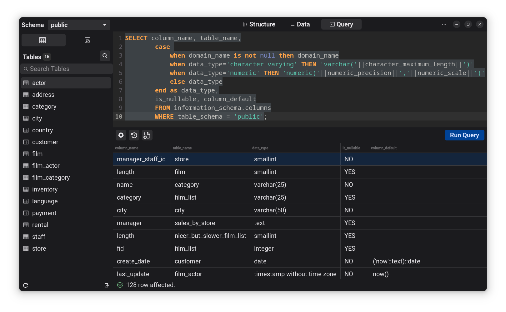

<!--
    2023 ppvan phuclaplace@gmail.com
-->
<h1 align="center">
<br/>
    PSequel
</h1>

<p align="center">
<a href="https://stopthemingmy.app">
    
</a>
</p>

<p align="center">
<a href="https://flathub.org/apps/me.ppvan.psequel">
    
</a>
</p>

<p align="center">
    
</p>


Small tool for quick sql query, specialized in PostgresSQL. Written in Vala for GNOME desktop in the hope to be useful.

> **This project is not a part of or affiliated with PostgreSQL.**

# Features
- Load and save connections.
- Import and Export connections info
- List schema info, tables, views.
- View table columns info, indexes, foreign keys
- View table data, sort by column
- Write query
- Query History
- Hightlight current query
- Export query data

# Installation

## Flatpak
> **Recommended**

<a href="https://flathub.org/apps/me.ppvan.psequel">Click here</a> to install app from Flathub.

## Build from source
### Via GNOME Builder
PSequel can be built with GNOME Builder >= 3.38. Clone this repo and click run button.

> (Warning: required to rebuild postgres, will take a little bit of time)

### Via Meson
Psequel can be built directly via Meson:
```bash
git clone https://github.com/ppvan/psequel
cd psequel
meson build
cd build
meson compile
```
Next, it can be installed by `meson install`.

# Dependencies
If you use GNOME Builder or Flatpak, dependencies will be installed automatically. If you use pure Meson, dependencies will be:
- vala >= 0.56
- gtk >= 4.10
- gtksourceview >= 5.0
- gio >= 2.74
- json-glib >= 1.6
- libadwaita >= 1.4
- postgres-libs >= 16.2
- libcsv >= 3.0

# Contributions
Contributions are welcome.

# Credits

- [Psequel](https://psequel.com/) - MacOS postgresql client. This project is inspired by Psequel.
- [libpg_query](https://github.com/pganalyze/libpg_query) - PostgresSQL parser
- [libcsv](https://github.com/rgamble/libcsv) - Robust C csv library